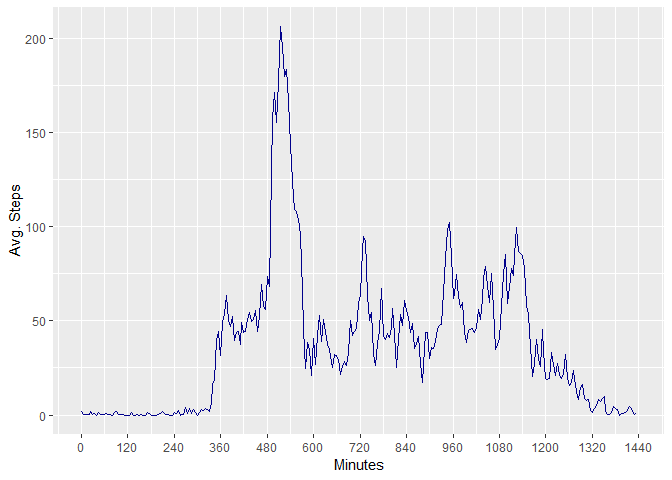
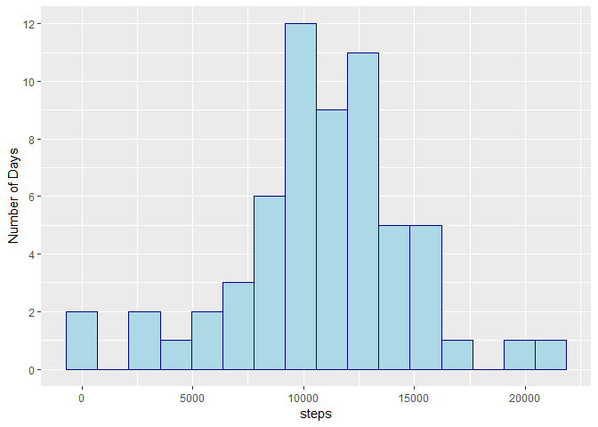
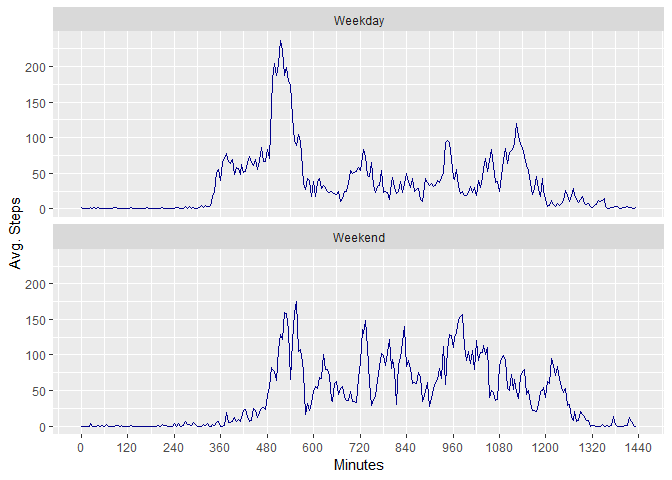

In this assignment, I have followed the steps requested in the assignment to create this Rmd document. The GitHub repository for this project can be found [here](https://github.com/mvaidhy/RepData_PeerAssessment1)

The data need for this project is the posted [Acitivity Monitoring Data](https://d396qusza40orc.cloudfront.net/repdata%2Fdata%2Factivity.zip).

Loading and preprocessing the data
----------------------------------

Before loading the data, let us load the libraries we will need for this project:

``` r
library(data.table)
library(dplyr)
library(ggplot2)
```

Now let us load the data into a tibble

``` r
activity <- tbl_df(fread(".\\activity.csv"))
```

This data set is supposed to have 17,568 observations. The variables that should be included in this dataset are:
1. **steps**: Number of steps taking in a 5-minute interval (missing values are coded as 'NA')
2. **date**: The date on which the measurement was taken in YYYY-MM-DD format
3. **interval**: Identifier for the 5-minute interval in which measurement was taken

Let us verify

``` r
activity
```

    ## # A tibble: 17,568 x 3
    ##    steps date       interval
    ##    <int> <chr>         <int>
    ##  1    NA 2012-10-01        0
    ##  2    NA 2012-10-01        5
    ##  3    NA 2012-10-01       10
    ##  4    NA 2012-10-01       15
    ##  5    NA 2012-10-01       20
    ##  6    NA 2012-10-01       25
    ##  7    NA 2012-10-01       30
    ##  8    NA 2012-10-01       35
    ##  9    NA 2012-10-01       40
    ## 10    NA 2012-10-01       45
    ## # ... with 17,558 more rows

Looks good, except that the date is of character type. Let us convert it to a date type. Also, the 'interval' is in a funny format, the last two digits representing the minute, and the rest the hour. Let us add a column to represent the number of minutes starting from midnight. We will also add a weekday factor as we will need this later.

``` r
activity <- activity %>% mutate(date = as.Date(date), minute = 60*(interval %/% 100) + interval %%100, weekday = as.factor(weekdays(date)))
```

Now we are all set!

Total number of steps taken per day.
------------------------------------

For this part of the assignment, we are going to ignore the missing values in the dataset. So we can compute the total number of steps per day as follows:

``` r
activity_summary <- activity %>% filter(!is.na(steps)) %>% group_by(date) %>% summarize(steps = sum(steps))
```

Let us now look at the histogram of this data

``` r
ggplot(data = activity_summary, aes(steps)) + geom_histogram(bins=16, color='darkblue', fill='lightblue') + labs(y = 'Number of Days') + scale_y_continuous(breaks=seq(0,12,2))
```


Now let's run a summary on the data to find out the mean and median.

``` r
steps_mean <- mean(activity_summary$steps)
steps_median <- median(activity_summary$steps)
summary(activity_summary$steps)
```

    ##    Min. 1st Qu.  Median    Mean 3rd Qu.    Max. 
    ##      41    8841   10765   10766   13294   21194

Average daily activity pattern
------------------------------

Obviously, the histogram does not tell the whole story. Let's make a time series plot which shows the average number of steps taken by minute of day; the average taken across all days. Again, we will skip the observations with missing data.

``` r
activity_by_minute <- activity %>% filter(!is.na(steps)) %>% group_by(minute) %>% summarize(avg_steps = mean(steps))
ggplot(data = activity_by_minute, aes(x=minute, y=avg_steps)) + geom_line(color="darkblue") + scale_x_continuous(breaks=seq(0,1440,120)) + labs(x="Minutes", y="Avg. Steps")
```



Hmmm ... there seems to be a peak between 8am and 9am. Let us find more. The minute that corresponds to this peak is:

``` r
activity_by_minute[which.max(activity_by_minute$avg_steps),]$minute
```

    ## [1] 515

This corresponds to the interval between *8:35* AM and *8:40 AM* (or interval *835*). Looks like this dude has to catch the 8.45 train!
**Note**: I plotted the data against the actual minutes and not against the 'interval' column, because the latter is discontinuous and hence the graph does not represent the reality well.

Imputing missing values
-----------------------

So far we have ignoring the missing values. Let's device a strategy for those.

First let's find out how many there are.

``` r
na_count <- activity %>% filter(is.na(steps)) %>% nrow()
```

We have 2304 observations with missing data.

Now let us substitute those missing values with imputed ones. I am going to find the average value for each 5-minute interval by day of week over the whole range of data. The missing ones will be replaced by the average value for the corresponding minute interval and day of week. So here goes:

``` r
activity_by_w_m <- activity %>% filter(!is.na(steps)) %>% group_by(weekday, minute) %>% summarize(avg_steps = mean(steps))

activity_imputed <- activity %>% inner_join(activity_by_w_m, by = c("weekday", "minute")) %>% mutate(steps = ifelse(is.na(steps), avg_steps, steps))

activity_imputed_summary <- activity_imputed %>% group_by(date) %>% summarize(steps = sum(steps))
```

Let's summarize the data updated with imputed values and replot the histogram

``` r
steps_imputed_mean <- mean(activity_imputed_summary$steps)
steps_imputed_median <- median(activity_imputed_summary$steps)
summary(activity_imputed_summary$steps)
```

    ##    Min. 1st Qu.  Median    Mean 3rd Qu.    Max. 
    ##      41    8918   11015   10821   12811   21194

``` r
ggplot(data = activity_imputed_summary, aes(steps)) + geom_histogram(bins=16, color='darkblue', fill='lightblue') + labs(y = 'Number of Days') + scale_y_continuous(breaks=seq(0,12,2))
```



As result of imputing the data, the mean number of steps by day change from 10766 to 10821 and the median changed from 10765 to 11015.

Weekend and Weekday patterns
----------------------------

Now let's split the activity data by weekdays and weekends plot the average time series for each segment separately to see if the patterns are different. To do so, first let us introduce a factor variable called 'day\_type'. Then we will run the summary and make the panel plot.

``` r
activity_imputed <- mutate(activity_imputed, day_type = as.factor(ifelse(weekday %in% c("Saturday", "Sunday"), "Weekend", "Weekday")))

activity_by_day_type <- activity_imputed %>% group_by(day_type, minute) %>% summarize(avg_steps = mean(steps))

ggplot(data = activity_by_day_type, aes(x=minute, y=avg_steps)) + geom_line(color="darkblue") + scale_x_continuous(breaks=seq(0,1440,120)) + labs(x="Minutes", y="Avg. Steps") + facet_wrap(~ day_type, nrow=2)
```



As we can clearly see, the weekend and weekday patterns are quite different. The early morning rush seen in the weekday graph is not present in the weekend average.
